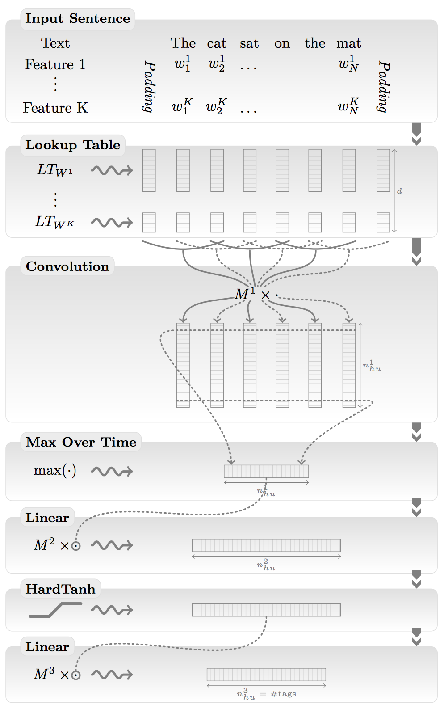

Understanding natural language with deep neural networks using Torch
====================================================================

Language is the main driver of human communication.  
Giving a machine the capability to learn and understand language gives us several products and possibilities that are not imaginable today.

One can understand language at varying granularities. 
When you learn a new language, you start with individual words, understanding their meaning, identifying similar and dissimilar words, developing a sense of contextual appropriateness of a word. You start with a small dictionary of words, building up your dictionary over time, mentally mapping each newly learnt word close to similar words in your dictionary.
Once you get familiar with your dictionary of individual words, you put them together into small sentences, learning grammar and structure.
You eventually combine sentences in a sensible way, to write paragraphs and pages. Once you get to this stage, you are comfortable with expressing complicated thoughts in language, letting others understand your thoughts and expression.

As an example, language understanding would give one the capability to understand that the sentences:
> "I'm on my way home." 

and 

> "I'm driving back home"

are conveying the information that you are going home.

For a machine to understand language, it first has to develop a mental map of words, their meaning and interaction with other words. 
It needs to build a dictionary of words, and understand where they stand semantically and contextually, compared to other words in their dictionary. 
To achieve this, each word is mapped to a set of numbers in a high-dimensional space, which are called "word embeddings". Similar words would be close to each other in this number space, and dissimilar words would be apart. 

Word embeddings can either be learnt in a general-purpose fashion before-hand by reading large amounts of text (like Wikipedia), or specially learnt for a particular task (like sentiment analysis).
We go into a little more detail on learning word embeddings in a later section.

[Picture of word embeddings word2vec]

After the word embeddings are learnt, the next problem to tackle would be to string words together appropriately in small, grammatically correct sentences which make sense. This is called [language modeling](http://en.wikipedia.org/wiki/Language_model). Language modeling is one part of quantifying how well the machine understands language.
For example, given a sentence ("I am eating pasta for lunch"), and a word ("cars"), if the machine can tell you with high confidence, whether the word is relevant to the sentence, or not ("cars" is related to this sentence with a probability 0.01 and I am pretty confident about it), then that would somewhat indicate that the machine understands words and contexts.

An even simpler metric is to predict the next word in the sentence. 
The machine should assign a probability to each word in it's dictionary, on the word's likeliness to appear next.

For example:
> I am eating _____

To fill the blank, a good language model would likely give higher probabilities to all edibles like `pasta`, `apple`, `chocolate` etc. and would give lower probability to other words in the dictionary which are contextually irrelevant like `taxi`, `building`, `music` etc.

A good language model would be key to several products that rely on more natural human interaction.

Traditionally language modeling has been done by computing `n-grams` -- which are groups of words -- and processing the `n-grams` further with heuristics, before feeding them into machine learning models.
For example, `2-grams` for the sentence
> "I am eating an apple."

are `I am`, `am eating`, `eating an`, `an apple`.

When you read a large amount of text like wikipedia, you could generate a new sentence by pairing together `2-grams` and `3-grams` and matching them with other pairs that were seen before. Sentences generated this way might be gramatically correct, but can also be totally non-sensical.

Over the last few years, deep neural networks have beaten n-gram based models comfortably on a wide variety of natural language tasks.

###Deep neural networks for Language

Deep learning --neural networks that have several stacked layers of neurons, usually accelerated in computation using GPUs-- has seen recent and huge success in many fields such as computer vision, speech recognition, and natural language processing, beating the previous state-of-the-art results on a wide variety of tasks and domains such as language modeling, translation, speech recognition, object recognition in images.

Within neural networks, there are certain kinds of neural networks that are more popular and well-suited to a wide variety of problems than others.

Continuing the topic of word embeddings, the neural networks that we shall discuss today are word-level networks, i.e. before being fed into the neural network, each word in the sentence is translated into a set of numbers.
These numbers change over time while the neural net trains itself, encoding unique properties such as semantics and contextual information of a word.
Word embeddings are not unique to neural networks, but they are common to all word-level neural language models.

Embeddings are stored in a simple Lookup Table (or hash table), and given a word, the embedding (which is an array of numbers) is returned.

For example:

These embeddings are usually initialized to random numbers (and learnt during the training phase of the neural network), or initialized from previously trained models over large texts like Wikipedia.

####Feedforward Convolution Neural Networks

*Convolution Neural Networks* (ConvNets), which were covered in our previous [blog post](http://devblogs.nvidia.com/parallelforall/deep-learning-computer-vision-caffe-cudnn/) from October, have recently enjoyed wide success in the last few years in several domains including images, video, audio and natural language processing.

Since ConvNets were previously discussed, we would like to keep their discussion brief, explaining their usage in language processing.
In case of images, convnets usually takes raw image pixels as input, interleaving convolution layers along with pooling layers with non-linear functions in between, finally followed by fully connected layers.

Similarly, for language processing, ConvNets take the outputs of word embeddings as input, and then apply interleaved convolution and pooling operations, followed by fully connected layers.

ConvNets for NLP, from Collobert et. a. (2011)

####Recurrent Neural Networks (In Progress)

Convolution Neural Networks --and more generally, feedforward neural networks-- do not traditionally have a notion of time or experience. 
After they are trained, given an input, they treat it no differently when shown the first time or the 100th time.
However, to tackle certain problems, you need to look at past experiences and give a different answer.

If you send word by word into a convolution network, asking it to predict the next word, it will do so, but without any notion of current context.
To understand why context is important, look at this example of predicting the next word:

I _____ -> shall
shall ____ -> do
do ____ -> you
you ____ -> are
are -> happy
"I shall do you are happy"

Clearly, without context, you can produce sentences that make no sense.

You can introduce the concept of context in feed forward networks, but it is much more natural to add a recurrent connection.

A Recurrent neural network introduces this concept of giving yourself feedback of past experiences. Apart from all the neurons in the network, it keeps a hidden state that changes as it sees different inputs. This hidden state is analogous to short-term memory.

[ figure of recurrent neural networks  for text ]

RNNs have

##### Long Short-Term Memory

#### Torch: Implementing ConvNets and Recurrent Nets efficiently

#### Beyond Natural Language: Learning to execute Python programs

#### References

Neural Probabilistic Language Model
NLP from scratch
word2vec
Neural Machien Translation
Learning to Execute
