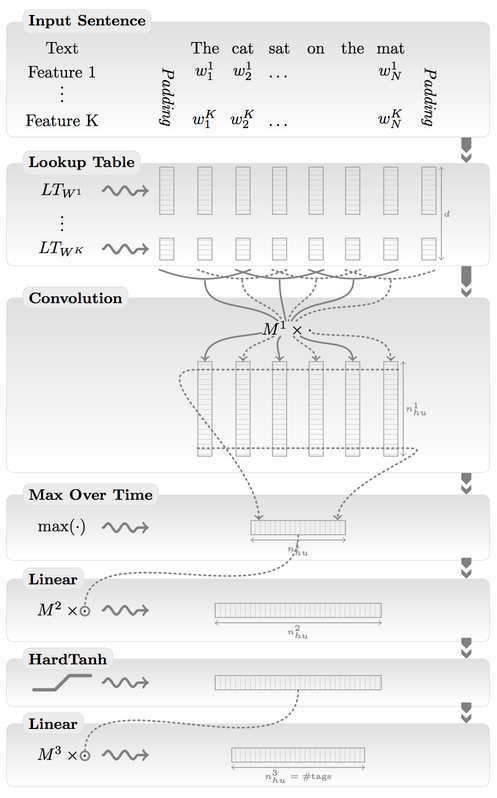
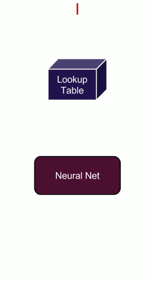
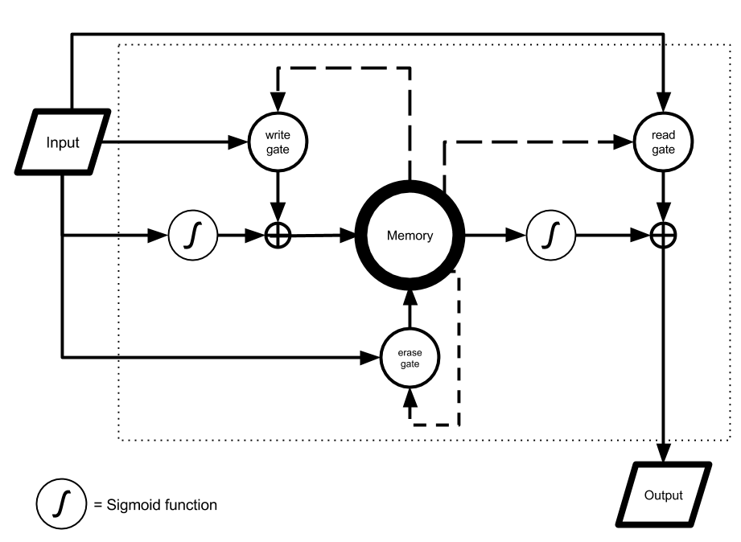

Understanding Natural Language with Deep Neural Networks Using Torch
====================================================================

*This post was written by Soumith Chintala and Wojciech Zaremba of Facebook.*

Language is the medium of human communication. Giving machines the capability to learn and understand language enables products and possibilities that are not imaginable today.

One can understand language at varying granularities. When you learn a new language, you start with individual words: understanding their meaning, identifying similar and dissimilar words, and developing a sense of contextual appropriateness of a word. You start with a small dictionary of words, building up your dictionary over time, mentally mapping each newly learned word close to similar words in your dictionary. Once you get familiar with your dictionary of individual words, you put them together into small sentences, learning grammar and structure. You eventually combine sentences in a sensible way, to write paragraphs and pages. Once you get to this stage, you are comfortable with expressing complicated thoughts in language, letting others understand your thoughts and expression.

As an example, language understanding gives one the capability to understand that the sentences

> "I'm on my way home." 

and 

> "I'm driving back home"

both convey the information that you are going home.

# Word Maps and Language Models

For a machine to understand language, it first has to develop a mental map of words, their meaning and interaction with other words. It needs to build a dictionary of words, and understand where they stand semantically and contextually, compared to other words in their dictionary. To achieve this, each word is mapped to a set of numbers in a high-dimensional space, which are called "word embeddings". Similar words are close to each other in this number space, and dissimilar words are far apart. Some word embeddings encode mathematical properties such as addition and subtraction (For some examples, see Table 1).

Word embeddings can either be learned in a general-purpose fashion before-hand by reading large amounts of text (like Wikipedia), or specially learned for a particular task (like sentiment analysis). We go into a little more detail on learning word embeddings in a later section.


[Table 1: Mikolov et. al. [3] showcase simple additive properties of their word embeddings.]

After the machine has learned word embeddings, the next problem to tackle is the ability to string words together appropriately in small, grammatically correct sentences which make sense. This is called [language modeling](http://en.wikipedia.org/wiki/Language_model). Language modeling is one part of quantifying how well the machine understands language. 

For example, given a sentence ("I am eating pasta for lunch."), and a word ("cars"), if the machine can tell you with high confidence whether or not the word is relevant to the sentence ("cars" is related to this sentence with a probability 0.01 and I am pretty confident about it), then that indicates that the machine understands something about words and contexts.

An even simpler metric is to predict the next word in the sentence. Given a sentence, for each word in its dictionary the machine assigns a probability of the word's likeliness to appear next in the sentence. For example:

> I am eating _____

To fill in the blank, a good language model would likely give higher probabilities to all edibles like `pasta`, `apple`, or `chocolate`, and it would give lower probability to other words in the dictionary which are contextually irrelevant like `taxi`, `building`, or `music`.

Traditionally language modeling has been done by computing `n-grams`&mdash;which are groups of words&mdash;and processing the `n-grams` further with heuristics, before feeding them into machine learning models. For example, the `2-grams` for the sentence

> "I am eating an apple."

are `I am`, `am eating`, `eating an`, and `an apple`.

When you read a large body of text, like wikipedia, you could generate a new sentence by pairing together `2-grams` and `3-grams` and matching them with other pairs that were seen before. Sentences generated this way might be gramatically correct, but they can also be totally non-sensical. Over the last few years, deep neural networks have beaten n-gram based models comfortably on a wide variety of natural language tasks.

## Deep neural networks for Language

Deep learning&mdash;neural networks that have several stacked layers of neurons, usually accelerated in computation using GPUs&mdash;has seen huge success recently in many fields such as computer vision, speech recognition, and natural language processing, beating the previous state-of-the-art results on a wide variety of tasks and domains such as language modeling, translation, speech recognition, and object recognition in images. 

Within neural networks, there are certain kinds of neural networks that are more popular and well-suited to a wide variety of problems than others. Continuing on the topic of word embeddings, let's discuss word-level networks, where each word in the sentence is translated into a set of numbers before being fed into the neural network. These numbers change over time while the neural net trains itself, encoding unique properties such as the semantics and contextual information for each word.

Word embeddings are not unique to neural networks; they are common to all word-level neural language models. Embeddings are stored in a simple lookup table (or hash table), that given a word, returns the embedding (which is an array of numbers). Figure 2 shows and example.


*Figure 2: Word embeddings are usually stored in a simple lookup table. Given a word, the word vector of numbers is returned. Given a sentence, a matrix with vectors of each word in the sentence are returned.*

Word embeddings are usually initialized to random numbers (and learned during the training phase of the neural network), or initialized from previously trained models over large texts like Wikipedia.

### Feed-forward Convolutional Neural Networks

*Convolutional Neural Networks* (ConvNets), which were covered in [a previous Parallel Forall post by Evan Shelhamer](http://devblogs.nvidia.com/parallelforall/deep-learning-computer-vision-caffe-cudnn/), have enjoyed wide success in the last few years in several domains including images, video, audio and natural language processing.

When applied to images, ConvNets usually take raw image pixels as input, interleaving convolution layers along with pooling layers with non-linear functions in between, followed by fully connected layers. Similarly, for language processing, ConvNets take the outputs of word embeddings as input, and then apply interleaved convolution and pooling operations, followed by fully connected layers. Figure 3 shows an example ConvNet applied to sentences.



[Figure 3: ConvNets are applied to text by Collobert et. al. [2]. These ConvNets are largely the same as the ones used for object classification on images.

### Recurrent Neural Networks (RNN)

Convolutional Neural Networks&mdash;and more generally, feed-forward neural networks&mdash;do not traditionally have a notion of time or experience unless you explicitly pass samples from the past as input. After they are trained, given an input, they treat it no differently when shown the input the first time or the 100th time. But to tackle some problems, you need to look at past experiences and give a different answer.

If you send sentences word-by-word into a feed-forward network, asking it to predict the next word, it will do so, but without any notion of the current context. The animation in Figure 4 shows why context is important.



[Figure 4: The importance of context. Predicting the next word, given only the previous word and no context.]

Clearly, without context, you can produce sentences that make no sense. You *can* have context in feed-forward networks, but it is much more natural to add a recurrent connection.

A Recurrent neural network has the capability to give itself feedback from past experiences. Apart from all the neurons in the network, it maintains a hidden state that changes as it sees different inputs. This hidden state is analogous to short-term memory. It remembers past experiences and bases its current answer on both the current input as well as past experiences. An illustration is shown in Figure 5.


[Figure 5: A recurrent neural network has memory of past experiences. The recurrent connection preserves these experiences and helps the network keep a notion of context.]

### Long Short Term Memory (LSTM)

RNNs keep context in their hidden state (which can be seen as memory). However, classical recurrent networks forget context very fast. They take into account very few words from the past while doing prediction. Here is an example of a language modelling problem that requires longer-term memory.

> I bought an apple ... I am eating the _____

The probability of the word `apple` should be much higher than any other edible like `banana` or `spaghetti`, because the previous sentence mentioned that you bought an `apple`. Furthermore, any edible is a much better fit than non-edibles like `car`, or `cat`.

Long Short Term Memory (LSTM) [6] units try to address the problem of such long-term dependencies. LSTM has multiple gates that act as a differentiable RAM memory. Access to memory cells is guarded by `update`, and `forget` gates. Information stored in memory cells is available to the LSTM for a much longer time than in a classical RNN, which allows the model to make more context-aware predictions. An LSTM unit is shown in Figure 6.



Figure 6: Illustration of an LSTM unit from Srivistava et. al. [8]. The input gate controls the amount of current input to be remembered, the output gate controls the amount of the current memory to be given as output to the next stage, and the erase gate controls what part of the memory cell is erased and retained in the current time step. 

An exact understanding of how LSTM works is unclear, and is a topic of contemporary research. However, it is known that LSTM outperforms conventional RNNs on many tasks. 

## Torch + cuDNN + cuBLAS: Implementing ConvNets and Recurrent Nets efficiently

[Torch](http://torch.ch) is a scientific computing framework with packages for neural networks and optimization (among hundreds of others). It is based on the Lua language, which is similar to javascript and is treated as a wrapper for optimized C/C++ and CUDA code.

At the core of Torch is a powerful tensor library similar to [Numpy](http://www.numpy.org). The Torch tensor library has both CPU and GPU backends. The neural networks package in torch implements *modules*, which are different kinds of neuron layers, and *containers*, which can have several modules within them. Modules are like lego blocks, and can be plugged together to form complicated neural networks.

Each module implements a function and it's derivative. This makes it easy to calculate the derivative of any neuron in the network with respect to the *objective function* of the network (via the [chain rule](http://en.wikipedia.org/wiki/Chain_rule)). The objective function is simply a mathematical formula to calculate how well a model is doing on the given task. Usually, the smaller the objective, the better the model performs.

The following small example of modules shows how to calculate the element-wise `Tanh` of an input matrix, by creating an `nn.Tanh` module and passing the input through it. We calculate the derivative with respect to the objective by passing it in the backward direction.

```lua
input = torch.randn(100)
m = nn.Tanh()
output = m:forward(input)
InputDerivative = m:backward(input, ObjectiveDerivative)
```

Implementing the ConvNet shown in Figure 3 is also very simple with Torch. In this example, we put all the modules into a `Sequential` container that chains the modules one after the other.

```lua
nWordsInDictionary = 100000
embeddingSize = 100
sentenceLength = 5
m = nn.Sequential()   -- a container that chains it's modules one after the other
m:add(nn.LookupTable(nWordsInDictionary, embeddingSize))
m:add(nn.TemporalConvolution(sentenceLength, 150, embeddingSize))
m:add(nn.Max(1))
m:add(nn.Linear(150, 1024))
m:add(nn.HardTanh())
m:add(nn.Linear())
 
m:cuda() -- transfer the model to GPU
```

This ConvNet has :forward and :backward functions that allow you to train your network (on CPUs or GPUs). Here we transfer it to the GPU by calling `m:cuda()`.

An extension to the `nn` package is the `nngraph` package which lets you build arbitrary acyclic graphs of neural networks. `nngraph` makes it easier to build complicated modules such as the LSTM memory unit, as the following example code demonstrates.

```lua
local function lstm(i, prev_c, prev_h)
  local function new_input_sum()
    local i2h            = nn.Linear(params.rnn_size, params.rnn_size)
	local h2h            = nn.Linear(params.rnn_size, params.rnn_size)
	return nn.CAddTable()({i2h(i), h2h(prev_h)})
  end
  local in_gate          = nn.Sigmoid()(new_input_sum())
  local forget_gate      = nn.Sigmoid()(new_input_sum())
  local in_gate2         = nn.Tanh()(new_input_sum())
  local next_c           = nn.CAddTable()({
  nn.CMulTable()({forget_gate, prev_c}),
  nn.CMulTable()({in_gate,     in_gate2})
  })
  local out_gate         = nn.Sigmoid()(new_input_sum())
  local next_h           = nn.CMulTable()({out_gate, nn.Tanh()(next_c)})
  return next_c, next_h
end
```

With these few lines of code we can create powerful state-of-the-art neural networks, ready for execution on CPUs or GPUs with good efficiency.

[cuBLAS](https://developer.nvidia.com/cuBLAS), and more recently [cuDNN](), have accelerated deep learning research quite significantly, and the recent success of deep learning can be partly attributed to these awesome libraries from NVIDIA. cuBLAS is automatically used by Torch for performing BLAS operations such as matrix multiplications, and accelerates neural networks significantly compared to CPUs.

To use NVIDIA cuDNN in Torch, simply replace the prefix `nn.` with `cudnn.`. cuDNN accelerates the training of neural networks compared to Torch's default CUDA backend (sometimes up to 30%) and is often several orders of magnitude faster than using CPUs.

For language modeling, we've implemented an RNN-LSTM neural network [9] using Torch. It gives state-of-the-art results on a standard quality metric called perplexity. [The full source of this implementation is available here](https://github.com/wojzaremba/lstm).
We compare the training time of the network on an Intel Core i7 2.6 GHZ vs accelerating it on an NVIDIA GTX 980 GPU. 

Shown in the Table 1 are the times for a small RNN and a larger RNN. [The full source of this implementation is here](https://github.com/wojzaremba/lstm).

| Device                | Small-RNN | Large-RNN |
|-----------------------|-----------|-----------|
| Intel Core i7 2.6 GHZ |  156 mins | 9351 mins |
| NVIDIA GTX 980        |   30 mins | 1006 mins |
| Speedup               |  5.2x     | 9.29x     |

Table 1: Training times of a state-of-the-art recurrent network with LSTM cells on CPU vs GPU

## Beyond Natural Language: Learning to do math and execute Python programs

Recurrent Neural Networks seem to be very powerful learning models. But how powerful are they? Would they be able to learn how to add two decimal numbers? 

We trained an LSTM-RNN to predict the result of addition of two decimal numbers, which is almost the same problem as language modelling. In this case we ask the model to read a "sentence" character by character and try to tell what fits best into the missing space.

> 123 + 19 = ____

Here, the correct answer consists of 4 characters: "1", "4", "2", and the end of sequence character. Surprisingly, an LSTM with small tweaks is able to learn with 99% accuracy how to add numbers which are upto 9 digits.

> 13828700 + 10188872 = 24017572

Such a task involves learning about the carry operator, and how to add digits. On seeing this result, you might feel excited about how smart and powerful LSTM potentially is. However, deeper scrutinization reveals that LSTM is a cheater. Training it on sequences up to 9 digits gives good test performance on sequences up to 9 digits. Yet it fails on longer sequences of digits. This means that the LSTM hasn't learned the true algorithm behind number addition. Nonetheless, it did learn something about addition.

We have examined what an LSTM can do on much harder problems. For example, can an LSTM simulate computer program execution? We used the same code used in our addition example with different examples. This time the input consists of a character-level representation of a program in a restricted subset of python, and the target output is the result of program execution. Our examples look like the following code snippets.

```python
c=142012
for x in range(12):c-=166776
print(c)
```

```bash 
target output: -1820700
```

Once again LSTM proved to be powerful enough to somewhat learn the mapping from programs to program execution results. Prediction performance is far from 100%, which is achievable by a standard python interpreter. However, the LSTM gives far better prediction than pure chance.

How to make RNN-LSTM models even more powerful remains a research challenge. We bet that an LSTM which would be as powerful as a python interpreter should also be good for natural language processing tasks. The only difference between these tasks is the underlying language: Python vs. English!

#### References

1. Bengio, Yoshua, et al. "A neural probabilistic language model." The Journal of Machine Learning Research 3 (2003): 1137-1155.
2. Collobert, Ronan, et al. "Natural language processing (almost) from scratch." The Journal of Machine Learning Research 12 (2011): 2493-2537.
3. Mikolov, Tomas, et al. "Efficient estimation of word representations in vector space." arXiv preprint arXiv:1301.3781 (2013).
4. Sutskever, Ilya, Oriol Vinyals, and Quoc VV Le. "Sequence to sequence learning with neural networks." Advances in Neural Information Processing Systems. 2014.
5. Zaremba, Wojciech, and Ilya Sutskever. "Learning to execute." arXiv preprint arXiv:1410.4615 (2014).
6. Hochreiter, Sepp, and Jürgen Schmidhuber. "Long short-term memory." Neural computation 9.8 (1997): 1735-1780.
7. Collobert, Ronan, Koray Kavukcuoglu, and Clément Farabet. "Torch7: A matlab-like environment for machine learning." BigLearn, NIPS Workshop. No. EPFL-CONF-192376. 2011.
8. Srivastava, Nitish, Elman Mansimov, and Ruslan Salakhutdinov. "Unsupervised Learning of Video Representations using LSTMs." arXiv preprint arXiv:1502.04681 (2015).
9. Zaremba, Wojciech, Ilya Sutskever, and Oriol Vinyals. "Recurrent neural network regularization." arXiv preprint arXiv:1409.2329 (2014).
10. http://torch.ch
11. https://github.com/wojzaremba/lstm
12. https://github.com/wojciechz/learning_to_execute

